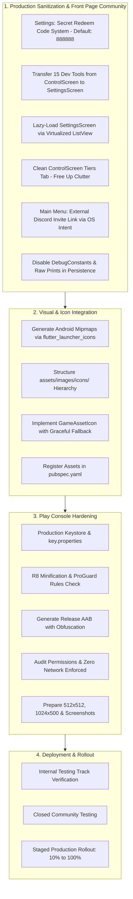

# Production.Inc v2.0 — Final Checks, Cleanups & Google Play Release Preparation Tracker (`RELEASE_PREPARATION_AND_CLEANUP.md`)

> **Document Status**: 🟡 **Active Working Tracker**  
> **Milestone**: Version 2.0.0 Final Release Candidate (`2.0.0+20`)  
> **Target Store**: Google Play Console (Android)  
> **Pre-requisite Status**: ✅ Phases 1–12 Completed (314/314 Tests Passing, 0 Analyzer Issues)  
> **Created**: September 27, 2026  

---

## 🎯 Executive Overview & Purpose

Following the successful completion and verification of **Version 2.0 (v2.0 Major Update)** across Phases 1 through 12, this document serves as the single source of truth and granular execution roadmap for the **Final Pre-Launch Checks and Google Play Console Release Preparation**.

Before distributing *Production.Inc* to real players on the Google Play Store, critical release-hardening steps must be executed:
1. **Developer "Mods" & Debug Sanitization**: Clean up and gate developer cheat controls, debug tools, and verbose console logging so production players experience an authentic, untampered tycoon progression.
2. **App & In-Game Icon Asset Integration**: Build and verify launcher icons across all Android mipmap densities, register asset pathways, and integrate the custom icons created for materials, products, machinery, fleet, tiers, and tech trees.
3. **Google Play Store Policy & Packaging Compliance**: Configure production app signing, enable R8 code shrinking and ProGuard protection, audit permissions, prepare Data Safety declarations, and verify offline integrity.



---

## 🧹 Pillar 1: Debug Controls, Secret Redeem Codes & Settings Lazy Loading

### 1.1 Secret Redeem Code System (`888888`) & Dev Tools Transfer to Settings
During the development of Phases 1 through 12, extensive developer tools were placed directly into [`ControlScreen`](file:///Users/Kamish/Desktop/JEBZ%20DEVVV/Main%20Projects/Game1/lib/screens/control_screen.dart) under the `Tiers` tab (`_buildDevControlsSection`). These tools grant instant cash, golden shares, cycle factory/fleet tiers, force 100% wear, and instant-unlock products.

To prepare for Google Play Store publication while retaining quick testing capabilities for QA and future updates:
1. **Redeem Codes Input Card on Settings Screen**:
   - A modern "Redeem Code" card added to [`SettingsScreen`](file:///Users/Kamish/Desktop/JEBZ%20DEVVV/Main%20Projects/Game1/lib/screens/settings_screen.dart) featuring an uppercase-formatted text field (`TextField`) and a high-contrast "Redeem" button.
   - **Two Distinct Code Categories & Lifecycle Behaviors**:
     - **A. Ephemeral Session Debug Codes (`888888`)**:
       - **Lifecycle**: **In-memory session only**. Never persisted to database or storage.
       - **Auto-Relock on App Exit**: Every time the app closes, exits, or is terminated from multitasking, the developer mode flag resets to `false`. Users/testers must re-enter `888888` on fresh launch to access developer tools.
       - **Re-usability**: Can be entered multiple times across separate play sessions.
       - **Action**: Dynamically expands and reveals the lazy-loaded Developer Tools panel with confirmation (`🛠️ Developer Tools Unlocked! (Session Only)`).
     - **B. Persistent One-Time Reward / Community Codes (`PRODUCTION2026`)**:
       - **Lifecycle**: **Persistent per player save file**. Tracked in SQLite / SharedPreferences (e.g. `redeemed_codes` set).
       - **One-Time Redemption Policy**: A code can strictly only be redeemed once per game file. Re-entering an already claimed code displays `⚠️ Code has already been redeemed!`.
       - **Reward Payload**: Entering **`PRODUCTION2026`** grants **+\$5,000 Cash / Credits** directly to the player's wallet balance with celebration feedback (`🎉 Redeemed PRODUCTION2026! +$5,000 Cash added!`).
       - **Invalid Feedback**: Unknown or mistyped codes display `❌ Invalid redeem code.`.

| Code String | Category | Persistence / Storage | Effect / Reward | Re-usability Rule |
| :--- | :--- | :--- | :--- | :--- |
| **`888888`** | **Developer Suite Unlock** | **In-Memory Only** (Session State) | Unlocks & reveals 15 Dev Tools in Settings | Re-enterable every app session; auto-locks on app exit |
| **`PRODUCTION2026`** | **Launch Celebration Gift** | **Persistent** (`redeemed_codes` DB table) | Awards **+\$5,000 Cash / Credits** to balance | **Strictly one-time only** per player save |

2. **Complete Transfer of Dev Tools from Control Screen to Settings Screen**:
   - Remove `_buildDevControlsSection` entirely from [`ControlScreen`](file:///Users/Kamish/Desktop/JEBZ%20DEVVV/Main%20Projects/Game1/lib/screens/control_screen.dart) (`_buildTiersSection`).
   - The `Tiers` tab in `ControlScreen` is completely cleared of developer clutter, leaving only the sleek [`FactoryTierCard`](file:///Users/Kamish/Desktop/JEBZ%20DEVVV/Main%20Projects/Game1/lib/widgets/factory_tier_card.dart) and tier progression metrics.
   - Transfer all 15 dev controls to [`SettingsScreen`](file:///Users/Kamish/Desktop/JEBZ%20DEVVV/Main%20Projects/Game1/lib/screens/settings_screen.dart), housed inside a conditionally rendered, lazy-built Developer Section.

| Transferred Dev Tool | Function / Mod Action | Settings Destination |
| :--- | :--- | :--- |
| **Cycle Factory Tier** | Cycles Factory Tiers 1–4 | `SettingsScreen` (Unlocked Dev Section) |
| **Cycle Fleet Tier** | Cycles Logistics Fleet Tiers 1–4 | `SettingsScreen` (Unlocked Dev Section) |
| **Boost Reputation** | Adds +100 corporate client reputation | `SettingsScreen` (Unlocked Dev Section) |
| **Refresh Contracts** | Force regenerates active B2B contracts | `SettingsScreen` (Unlocked Dev Section) |
| **Add Research Points** | Grants +250 RP for tech tree testing | `SettingsScreen` (Unlocked Dev Section) |
| **Reset/Simulate Wear** | Sets factory maintenance wear to 0% or 100% | `SettingsScreen` (Unlocked Dev Section) |
| **Add Golden Shares** | Grants +10 Golden Shares (+100% speed) | `SettingsScreen` (Unlocked Dev Section) |
| **Add Cash ($1k / $10k / $1M)** | Injects money into wallet balance | `SettingsScreen` (Unlocked Dev Section) |
| **Complete Productions** | Bypasses all active crafting timers | `SettingsScreen` (Unlocked Dev Section) |
| **Complete Shipments** | Bypasses all active logistics fleet transit | `SettingsScreen` (Unlocked Dev Section) |
| **Unlock All Products** | Unlocks all catalog products across branches | `SettingsScreen` (Unlocked Dev Section) |
| **Force Unlock Check** | Manually triggers unlock condition evaluation | `SettingsScreen` (Unlocked Dev Section) |

---

### 1.2 Lazy-Loading Architecture for Settings Screen (Memory & Battery Optimization)

#### Problem Analysis:
The Settings page is an infrequent destination during standard gameplay sessions. However, [`SettingsScreen`](file:///Users/Kamish/Desktop/JEBZ%20DEVVV/Main%20Projects/Game1/lib/screens/settings_screen.dart) currently renders inside an eager `SingleChildScrollView(child: Column(...))`. This creates and allocates all widget nodes—including extensive text blocks, dialog closures, live game statistics, performance tiles, and all 15 developer tool widgets—immediately upon instantiation. Holding unneeded widgets in the heap consumes valuable RAM and CPU cycles, degrading mobile battery efficiency.

#### Lazy-Loading Implementation Blueprint:
1. **Virtualized List Layout (`ListView.builder` / `CustomScrollView`)**:
   - Refactor `SettingsScreen` body to use a virtualized `ListView.builder` or `SliverList`.
   - Sections are divided into distinct index-based items that are built *strictly on-demand* as they scroll into view:
     - `Item 0`: Game Data Section (Save / Reset)
     - `Item 1`: Redeem Codes Section (Input field + Redeem action)
     - `Item 2`: App Settings & Toggles (Notifications, Performance Mode)
     - `Item 3`: Help & Tutorials (Collapsible buttons)
     - `Item 4`: Live Game Telemetry & Statistics
     - `Item 5`: Developer Tools Section (**only rendered if unlocked via `888888`**)
     - `Item 6`: Battery & Auto-Save Optimization Info
2. **Deferred Dev Tools Instantiation**:
   - If `isDeveloperModeUnlocked` is `false`, the developer widget tree is never allocated or held in memory.
   - When unlocked via `888888`, the 15 dev buttons are lazy-built in a sub-list or collapsible card only when scrolled into view.
3. **RAM & Battery Conservation**:
   - Off-screen sections are unmounted/recycled when scrolled out of view (`addAutomaticKeepAlives: false`, `addRepaintBoundaries: true`).
   - Drastically reduces peak widget tree depth and memory allocations on lower-end Android devices.

---

### 1.3 Debug Constants & Logging Sanitization
Review logging constants in [`lib/constants/game_constants.dart`](file:///Users/Kamish/Desktop/JEBZ%20DEVVV/Main%20Projects/Game1/lib/constants/game_constants.dart) and raw `print()` statements:

- [ ] **Turn off Verbose Persistence Logging**:
  In `DebugConstants`:
  ```dart
  class DebugConstants {
    static const bool verboseProductionLogging = false;
    static const bool unlockSystemLogging = false;
    static const bool performanceLogging = false;
    static const bool persistenceLogging = false; // Change from true to false for release
  }
  ```
- [ ] **Sanitize Raw `print()` Statements**:
  In [`GamePersistenceService`](file:///Users/Kamish/Desktop/JEBZ%20DEVVV/Main%20Projects/Game1/lib/services/game_persistence_service.dart), replace remaining raw `print(...)` calls in database migration routines with logger calls or wrap strictly in `if (kDebugMode)`.
- [ ] **Ensure Test Helpers are Guarded**:
  Confirm all `@visibleForTesting` methods in [`ProductionGameService`](file:///Users/Kamish/Desktop/JEBZ%20DEVVV/Main%20Projects/Game1/lib/services/production_game_service.dart) (`testSetManifest`, `processAutoSellTickForTest`, `addContractForTest`, `testSetState`, etc.) are never invoked by any production UI screen or normal loop.

---

### 1.4 Main Menu Community Integration: External Discord Redirect (100% Offline Preservation)

#### Community Invite Specification:
- **Target URL**: `https://discord.gg/7yH3jgMnhf` (Permanent, never-expiring community invite code).
- **Target Location**: [`MainMenuScreen`](file:///Users/Kamish/Desktop/JEBZ%20DEVVV/Main%20Projects/Game1/lib/screens/main_menu_screen.dart) (Front / Starting Page, accessible directly before a player enters the game).
- **UI Design**: Styled menu action button or social banner using Discord's signature Blurple palette (`#5865F2`), complete with a community icon, polished hover/tap feedback, and a clear label (`Join Discord Community`).

#### 100% Offline Architecture Invariant (External OS-Delegated Intent Hand-off):
- **Zero In-App WebViews or Network Sockets**: The game does *not* instantiate an internal WebView, embedded browser, or HTTP network client.
- **System Intent Launching**: When the player taps the Discord button, the app fires an external Android system intent via `android_intent_plus`:
  ```dart
  final intent = AndroidIntent(
    action: 'android.intent.action.VIEW',
    data: 'https://discord.gg/7yH3jgMnhf',
  );
  await intent.launch();
  ```
- **External App Delegation**: The Android OS receives the `ACTION_VIEW` intent and delegates it externally to the user's installed Discord app (or default web browser if Discord is not installed).
- **Offline & Regulatory Compliance**: *Production.Inc* itself continues running 100% offline, keeping zero open sockets, zero internet permissions in `main/AndroidManifest.xml`, and complete Google Play Data Safety compliance.

---

## 🎨 Pillar 2: App Icon & Custom Game Visual Assets Integration

### 2.1 Launcher Icon Generation (Android & Web)
The app icon source file is located at `assets/images/AppIcon.png`. The configuration in `pubspec.yaml` utilizes `flutter_launcher_icons`:

```yaml
flutter_launcher_icons:
  android: "launcher_icon"
  image_path: "assets/images/AppIcon.png"
  adaptive_icon_background: "#2196F3"
  adaptive_icon_foreground: "assets/images/AppIcon.png"
  web:
    generate: true
    image_path: "assets/images/AppIcon.png"
    background_color: "#2196F3"
    theme_color: "#2196F3"
```

#### Verification & Generation Tasks:
- [ ] Run `dart run flutter_launcher_icons` to re-generate mipmap densities if `AppIcon.png` has been updated.
- [ ] Verify generated mipmaps in `android/app/src/main/res/`:
  - `mipmap-mdpi/launcher_icon.png` (48x48)
  - `mipmap-hdpi/launcher_icon.png` (72x72)
  - `mipmap-xhdpi/launcher_icon.png` (96x96)
  - `mipmap-xxhdpi/launcher_icon.png` (144x144)
  - `mipmap-xxxhdpi/launcher_icon.png` (192x192)
  - `mipmap-anydpi-v26/launcher_icon.xml` (Adaptive icon definition)
- [ ] Verify `AndroidManifest.xml` points to `@mipmap/launcher_icon` for both `android:icon` and `android:roundIcon` (if applicable).
- [ ] Provide Android 13+ themed monochrome icon XML layer (`<monochrome android:drawable="..." />`).

---

### 2.2 In-Game Icon Assets Integration (Roadmap Batches 1–8)
According to [`ICON_DESIGN_ROADMAP.md`](ICON_DESIGN_ROADMAP.md), custom visual icons replace placeholder emojis across 8 prioritized batches.

#### Target Directory Architecture (`assets/images/icons/`):
```text
assets/
└── images/
    ├── AppIcon.png
    └── icons/
        ├── materials/      # mat_cardboard.svg, mat_basic_metals.svg, etc.
        ├── products/       # prod_box.svg, prod_wires.svg, etc.
        ├── machines/       # mach_auto_buy.svg, mach_build_basic.svg, etc.
        ├── fleet/          # fleet_courier_bike.svg, fleet_delivery_van.svg, etc.
        ├── tiers/          # tier1_garage.svg, tier2_workshop.svg, etc.
        ├── research/       # tech_overclock.svg, tech_discount.svg, etc.
        ├── clients/        # client_orbit.svg, client_apex.svg, etc.
        ├── prestige/       # golden_share.svg, ipo_bell.svg, etc.
        └── ui/             # ui_manifest_cart.svg, ui_portfolio.svg, etc.
```

#### Pubspec Asset Registration:
Ensure `pubspec.yaml` explicitly declares the directories:
```yaml
flutter:
  uses-material-design: true
  assets:
    - assets/images/
    - assets/images/icons/materials/
    - assets/images/icons/products/
    - assets/images/icons/machines/
    - assets/images/icons/fleet/
    - assets/images/icons/tiers/
    - assets/images/icons/research/
    - assets/images/icons/clients/
    - assets/images/icons/prestige/
    - assets/images/icons/ui/
```

#### Fail-Safe Visual Component (`GameIcon` via `flutter_svg`):
To prevent missing-asset runtime errors or layout breaks while individual icon batches are finalized:
- [x] Create a centralized widget `GameIcon(assetPath: '...', fallbackEmoji: '📦')` rendering vector assets via `flutter_svg` (`SvgPicture.asset`). (✅ **Completed**)
- [x] Wire `placeholderBuilder` and `errorBuilder` to render the fallback glyph smoothly if an asset file hasn't been copied to the bundle yet. (✅ **Completed**)
- [x] Connect custom icons into `RawMaterialCard`, `ProductCard`, `OrderItemsList`, `ShippingManifestDrawer`, and `RecipeRow`. (✅ **Completed**)

---

## 🛡️ Pillar 3: Google Play Console Release & Compliance Hardening

### 3.1 Android Build & Release Configuration
- [ ] **Version Synchronization**:
  - `pubspec.yaml`: `version: 2.0.0+20` (Confirmed).
  - `android/app/build.gradle.kts`: Verify `versionCode = 20` and `versionName = "2.0.0"`.
  - Android API Targets: `compileSdk = 36`, `targetSdk = 36`, `minSdk = 24`.
- [ ] **Release Keystore & `key.properties`**:
  - Create/verify `android/key.properties`:
    ```properties
    keyAlias=production_inc_key
    keyPassword=YOUR_KEY_PASSWORD
    storeFile=/path/to/upload-keystore.jks
    storePassword=YOUR_STORE_PASSWORD
    ```
  - Ensure `android/key.properties` and `.jks` are in `.gitignore` (never commit keys to source control).
- [ ] **R8 Code Shrinking & ProGuard Rules**:
  - In `android/app/build.gradle.kts`, verify release build type:
    ```kotlin
    buildTypes {
        release {
            isMinifyEnabled = true
            isShrinkResources = true
            proguardFiles(getDefaultProguardFile("proguard-android-optimize.txt"), "proguard-rules.pro")
            signingConfig = signingConfigs.getByName("release")
        }
    }
    ```
  - Verify `android/app/proguard-rules.pro` includes rules for SQLite (`sqflite`), Provider, and JSON serialization so release minification doesn't strip critical DB handlers.
- [ ] **Build Command**:
  ```bash
  flutter build appbundle --release --obfuscate --split-debug-info=build/app/outputs/symbols
  ```

---

### 3.2 Permissions & AndroidManifest Audit
Inspect `android/app/src/main/AndroidManifest.xml`:

| Permission | Declared in Main | Status | Production Audit Note |
| :--- | :---: | :---: | :--- |
| `android.permission.INTERNET` | **Removed** (Only in Debug/Profile) | ✅ Confirmed Offline | Removed from `main/AndroidManifest.xml`. Retained exclusively in `debug/` and `profile/` manifests for Flutter DevTools & Hot Reload. Release AAB will have **zero network permissions**. |
| `android.permission.VIBRATE` | Yes | ✅ Approved | Used for tactile haptic feedback on UI button taps. |
| `android.permission.WAKE_LOCK` | Yes | ✅ Approved | Keeps display awake during active factory assembly sessions. |
| *Dangerous Permissions* | None | ✅ Clean | Zero runtime permissions required (no camera, microphone, contacts, location, storage). |

---

### 3.3 Google Play Data Safety & Store Listing Deliverables
- [ ] **Data Safety Declarations**:
  - Data Collection: **No data collected**.
  - Data Sharing: **No data shared with third parties**.
  - Security Practices: Local sandbox storage via SQLite (`app_database.db`) & `SharedPreferences`.
  - Account Deletion: Not applicable (no cloud accounts or registration).
- [ ] **Privacy Policy URL**:
  - Host a lightweight static Privacy Policy page on GitHub Pages (or markdown document).
  - Add clickable Privacy Policy link in `SettingsScreen` under `App Settings`.
- [ ] **Store Listing Visual Assets**:
  - **High-Res Icon**: 512 × 512 px PNG (32-bit color, no alpha transparency).
  - **Feature Graphic**: 1024 × 500 px PNG / JPEG (landscape, showcasing factory floor & logistics fleet).
  - **Screenshots (1080 × 2400)**:
    1. Factory Production Floor (Assembly lines, Tier badges).
    2. Commercial Dispatch Manifest (Bulk selling tray & cart).
    3. Logistics Fleet Operations (Bikes to Cargo Planes).
    4. Control Center Automation (Auto-Buy, Build, and Auto-Sell).
    5. Corporate Contracts (B2B Retail & Manufacturing orders).
    6. R&D Lab & Tech Tree (Speed perks, material discounts).
    7. Wall Street Prestige & IPO (Golden Shares valuation).
    8. 100% Offline Gameplay (Zero ads, zero data connection needed).
- [ ] **Copywriting & Metadata**:
  - **Title**: `Production.Inc: Factory Tycoon`
  - **Short Description**: `Build, automate, and ship! Run an industrial tycoon manufacturing empire.`
  - **Full Description**: Highlight offline capability, 12-phase multi-tier economy, zero forced ads, and in-depth tech trees.

---

## ⚡ Pillar 4: Pre-Launch Verification & Staged Rollout Pipeline

### 4.1 Final Pre-Release Quality Gates
Execute the following verification suite prior to tagging `v2.0.0`:

1. **Full Automated Test Suite**:
   ```bash
   flutter test
   ```
   *Gate: 314 / 314 tests passed (100% green).*
2. **Static Analysis & Lint Check**:
   ```bash
   dart analyze
   ```
   *Gate: 0 errors, 0 warnings.*
3. **Airplane Mode Offline Verification**:
   - Install release build on physical device.
   - Switch device to Airplane Mode.
   - Boot game, produce items, dispatch shipments, save game, force-quit, reboot, verify state integrity.
4. **Lifecycle & Battery Optimization**:
   - Background app during active production and verify timers pause cleanly with zero background battery drain.

### 4.2 Staged Rollout Strategy
```text
┌─────────────────────────────────────────────────────────────┐
│ 1. Internal Testing Track (Team & Local Device Validation)  │
└──────────────────────────────┬──────────────────────────────┘
                               │
                               ▼
┌─────────────────────────────────────────────────────────────┐
│ 2. Closed Testing Track (Alpha / Beta Community Testers)    │
└──────────────────────────────┬──────────────────────────────┘
                               │
                               ▼
┌─────────────────────────────────────────────────────────────┐
│ 3. Production Staged Rollout                                │
│    • Day 1: 10% Rollout (Monitor crash telemetry & ANR)     │
│    • Day 3: 25% Rollout                                     │
│    • Day 5: 50% Rollout                                     │
│    • Day 7: 100% Full Global Availability                   │
└─────────────────────────────────────────────────────────────┘
```

---

## 📋 Comprehensive Execution Checklist

### Phase A: Developer "Mods" & Debug Cleanup (Redeem Code & Settings Lazy Load)
- [ ] Implement "Redeem Codes" card on [`SettingsScreen`](file:///Users/Kamish/Desktop/JEBZ%20DEVVV/Main%20Projects/Game1/lib/screens/settings_screen.dart) supporting:
  - **Ephemeral Debug Unlock (`888888`)**: Memory-only session flag; auto-relocks on app exit/closure.
  - **One-Time Persistent Codes (`PRODUCTION2026`)**: Grants +$5,000 credits; tracked in persistent database to prevent double redemption.
- [ ] Migrate [`SettingsScreen`](file:///Users/Kamish/Desktop/JEBZ%20DEVVV/Main%20Projects/Game1/lib/screens/settings_screen.dart) from `SingleChildScrollView` to virtualized lazy-loaded `ListView.builder` to conserve RAM and improve battery efficiency.
- [ ] Transfer all 15 developer controls from [`ControlScreen`](file:///Users/Kamish/Desktop/JEBZ%20DEVVV/Main%20Projects/Game1/lib/screens/control_screen.dart) to the unlocked Developer Tools section in `SettingsScreen`.
- [ ] Clean up [`ControlScreen`](file:///Users/Kamish/Desktop/JEBZ%20DEVVV/Main%20Projects/Game1/lib/screens/control_screen.dart) (`Tiers` tab) by removing `_buildDevControlsSection` to free up space and eliminate clutter.
- [ ] Update `DebugConstants.persistenceLogging = false` in [`lib/constants/game_constants.dart`](file:///Users/Kamish/Desktop/JEBZ%20DEVVV/Main%20Projects/Game1/lib/constants/game_constants.dart).
- [ ] Replace raw `print()` statements in [`GamePersistenceService`](file:///Users/Kamish/Desktop/JEBZ%20DEVVV/Main%20Projects/Game1/lib/services/game_persistence_service.dart) with Logger or `if (kDebugMode)` guards.
- [ ] Implement "Join Discord Community" button on [`MainMenuScreen`](file:///Users/Kamish/Desktop/JEBZ%20DEVVV/Main%20Projects/Game1/lib/screens/main_menu_screen.dart) delegating `https://discord.gg/7yH3jgMnhf` via `android_intent_plus` (`ACTION_VIEW`) to an external app/browser, preserving 100% offline gameplay.
- [ ] Audit all `@visibleForTesting` methods in [`ProductionGameService`](file:///Users/Kamish/Desktop/JEBZ%20DEVVV/Main%20Projects/Game1/lib/services/production_game_service.dart) to confirm zero production leaks.
- [ ] Run `flutter test` to ensure 314/314 tests remain green after refactoring.

### Phase B: App Icon & Asset Integration
- [ ] Run `dart run flutter_launcher_icons` and verify all Android mipmap densities and adaptive icons.
- [x] Create `assets/images/icons/` subdirectories (`materials`, `products`, `machines`, `fleet`, `tiers`, `research`, `clients`, `prestige`, `ui`). (✅ **Completed**)
- [x] Register new asset folders under `flutter.assets` in `pubspec.yaml` and install `flutter_svg: ^2.3.0`. (✅ **Completed**)
- [x] Add created icon SVG files into their respective subdirectories (Batch 1: Core Foundation 10 icons complete with clean alpha transparency and SVG packaging). (✅ **Completed**)
- [x] Implement `GameIcon` helper widget with `flutter_svg` and graceful fallback to emojis/Material icons. (✅ **Completed**)
- [x] Connect custom icons into `RawMaterialCard`, `ProductCard`, `OrderItemsList`, `ShippingManifestDrawer`, and `RecipeRow`. (✅ **Completed**)

### Phase C: Google Play Console Release Prep
- [ ] Verify version `2.0.0+20` in `pubspec.yaml` and `android/app/build.gradle.kts`.
- [ ] Setup production signing key and `android/key.properties` (secured in `.gitignore`).
- [ ] Verify R8 minification and `proguard-rules.pro` configurations.
- [x] Remove `android.permission.INTERNET` from `android/app/src/main/AndroidManifest.xml` (retained in debug/profile manifests) to ensure a 100% offline release with zero network permissions. (✅ **Completed**)
- [ ] Build release AAB (`flutter build appbundle --release --obfuscate --split-debug-info=...`).
- [ ] Prepare 512x512 icon, 1024x500 banner, and 8 promotional screenshots.
- [ ] Complete Google Play Data Safety form (declare 100% offline, 0 data collected).
- [ ] Host and link Privacy Policy URL in `SettingsScreen` and Play Console listing.
- [ ] Upload AAB to Internal Testing Track on Google Play Console.
