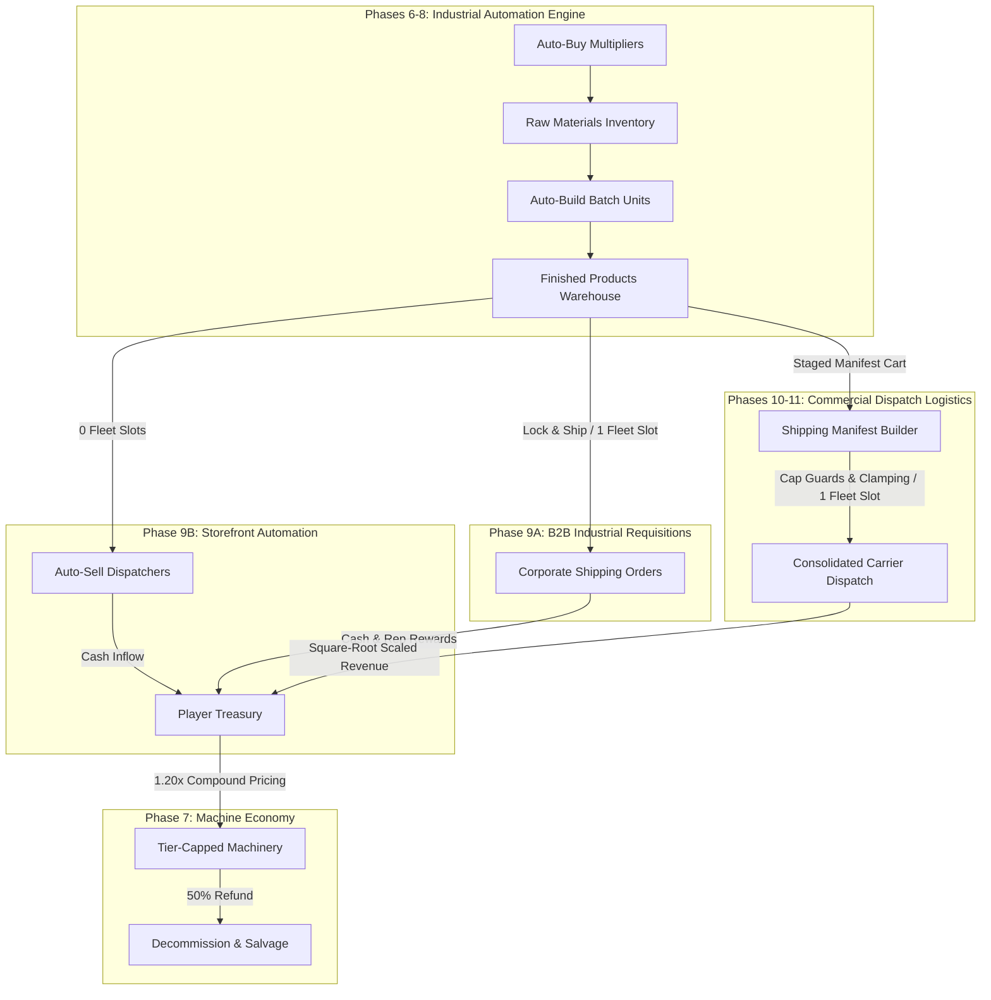

# Production.INC v2.0 Major Update — Active Task Backlog & Release Roadmap (`TODO_SEP_23.md`)

> **Document Purpose**: This file serves as the active, granular task backlog and implementation tracker for finalizing the **Version 2.0 (v2.0 Major Update)** of **Production.INC**.
>
> 🚀 **Version 2.0 Context**: Core **Phases 1 through 5** are fully implemented (see [`FUTURE_PLANS.md`](file:///Users/Kamish/Desktop/JEBZ%20DEVVV/Main%20Projects/Game1/FUTURE_PLANS.md)). To guarantee rapid, agile, and modular delivery, remaining features and fixes are partitioned into bite-sized, single-responsibility phases: **Phase 6** (Immediate Priority: Usability & Fixes), **Phase 7** (Machine Caps & Dynamic Pricing), **Phase 8** (Batch Throughput & Bulk Procurement), **Phase 9** (Auto-Sell Dispatchers), **Phase 10** (Logistics Fleet Payload Limits), and **Phase 11** (Multi-Product Manifest Cart).

---

## 🗺️ Version 2.0 Active Finalization Roadmap

| Phase | System / Feature | Target Area | Status | Impact in v2.0 |
| :---: | :--- | :--- | :---: | :--- |
| **6** | **Current Priority: Usability, Ergonomics & Critical Fixes** | All Screens & Controls | ✅ **Completed** | Resolves identified friction points: fleet counter on sell screen, lazy-loaded contracts archive, auto-buy buffer uncapping, unified machine cards, and RAM optimization. |
| **7** | **Machine Economy & Dynamic Pricing: Tier Limits & Salvage** | Control Screen (`Machines` Tab) & Engine | ✅ **Completed** | Implements tier-based machine ownership caps (10/20/30/40), exponential price scaling ($1,000 base, 1.15x curve), and 50% machine salvage refund. |
| **8** | **High-Throughput Automation: Batch Crafting & Bulk Procurement** | Crafting Engine & Procurement Loop | ✅ **Completed** | Symmetrical production rate upgrades: Auto-Build Batch Throughput (items crafted/tick) and Auto-Buy Intake Multipliers (materials purchased/tick). |
| **9A** | **B2B Contract Overhaul: Retail & Manufacturing Types** | Sell Products Screen & Contract Engine | 📋 **Planned** | Splits B2B contracts into Retail (premium finished goods, small qty) and Manufacturing (bulk parts, multi-product). Adds Lock & Ship fulfillment (no partial delivery), fleet slot consumption, `shipping` status, per-type auto-ship toggles, and relocates B2B tab to Sell Screen. |
| **9B** | **Auto-Sell Dispatchers: Storefront Automation** | Machines Tab & Storefront Loop | 📋 **Planned** | Unlocks timid Tier 1 Auto-Sell (1 unit/tick baseline), batch fulfillment upgrades, and direct storefront retail sales (0 fleet slots consumed). |
| **10** | **Logistics Fleet Overhaul: Payload Capacities & Variety Caps** | Shipping Screen & Fleet Engine | 📋 **Planned** | Adds physical payload capacity (20 $\to$ 600 units) and variety limits (2 $\to$ 12 types) across Bikes, Vans, Trucks, and Planes so carrier tiers truly matter. |
| **11** | **Commercial Dispatch Manifest: Multi-Product Bulk Selling UI** | Sell Products Screen | 📋 **Planned** | Adds docked manifest staging tray, interactive review drawer, multi-product selection, and consolidated single-carrier dispatches. |

---

## 🛠️ Phase 6: Usability, Ergonomics & Critical System Fixes (✅ Completed)

### 🎯 Objective & Overview
Phase 6 is the immediate active implementation priority for **Production.INC**, directly addressing player-reported friction points, UI ergonomics, and performance bottlenecks identified during gameplay testing. It focuses on resolving critical usability issues before adding further machine economy layers.

> [!IMPORTANT]
> **Active Focus**: This phase is prioritized for current implementation. All tasks below represent high-leverage fixes and ergonomics improvements that stabilize the existing core loop.

---

### 📋 Phase 6 Implementation Checklist

#### 1. 🏷️ Selling Products Screen: Logistics Fleet Capacity Visibility
- [x] **Fleet Capacity Metric on Financial Card**:
  - Update [`FinancialStatusDisplay`](file:///Users/Kamish/Desktop/JEBZ%20DEVVV/Main%20Projects/Game1/lib/widgets/financial_status_display.dart) (specifically when rendered in `FinancialDisplayMode.portfolio` on [`SellProductsScreen`](file:///Users/Kamish/Desktop/JEBZ%20DEVVV/Main%20Projects/Game1/lib/screens/sell_products_screen.dart)) to display an ongoing fleet counter beside `Total Products` and `Portfolio Value`.
  - Format: `Fleets in Transit: X / Max` (e.g., `🚚 2/4` or `Fleets: 2/6 Active`).
  - Provide immediate visual feedback on whether transport lines are fully saturated without requiring the player to switch back and forth between the Sell and Shipping screens.
  - Responsive column layout with subtle divider bars matching existing financial metrics.

#### 2. 📋 B2B Bulk Requisitions: Auto-Sorting & Lazy-Loaded Archive
- [x] **Completed Requisition Auto-Deprioritization**:
  - In [`ShippingScreen`](file:///Users/Kamish/Desktop/JEBZ%20DEVVV/Main%20Projects/Game1/lib/screens/shipping_screen.dart) (`B2B Contracts` tab), automatically sort contracts so fulfilled/completed requisitions sink to the bottom of the list below active contracts.
- [x] **Lazy-Loaded "Fulfilled Requisitions" Collapsible Section**:
  - Move fulfilled orders into a dedicated collapsible accordion/drawer (`Completed Requisitions (${fulfilled.length})`).
  - **Memory Optimization (RAM Conservation)**: Dynamically build contract item widgets *only* when the accordion is expanded (avoiding full widget instantiation and off-screen state holding in memory when collapsed).
  - Use `ListView.builder` with `shrinkWrap: true` or conditional child instantiation so completed orders don't bloat the widget tree or heap size during long play sessions.

#### 3. ⚙️ Machine Controls: Capacity Uncapping & UI Design Unification
- [x] **Auto-Buy Resource Capacity Uncapping**:
  - Remove or raise the artificial capacity ceiling on auto-buy (currently capped at 20-25 or tier-restricted) in [`ProductionGameService.increaseAutoBuyCapacity`](file:///Users/Kamish/Desktop/JEBZ%20DEVVV/Main%20Projects/Game1/lib/services/production_game_service.dart).
  - Align with auto-build machines behavior, allowing players to scale resource buffers freely as their late-game economy demands.
- [x] **Unified Machine Controls UI Architecture**:
  - Standardize the design between **Auto-Buy Machines** and **Auto-Build Machines** in [`ControlScreen`](file:///Users/Kamish/Desktop/JEBZ%20DEVVV/Main%20Projects/Game1/lib/screens/control_screen.dart) (`Machines` tab).
  - Unify components into consistent modular cards (matching styling, border radiuses, dark gradients, and elevation).
  - Uniform layout structure for both machine types:
    - **Header**: Machine Icon + Title + Active/Paused Status Badge + Master Toggle Switch.
    - **Fleet/Machine Count**: Stepper / Quantity badge with standardized `Buy Machine ($1,000)` action button.
    - **Capacity Stepper**: Identical `[-]` / `[+]` button styling, accent color coding, and capacity unit labels.
    - **Telemetry / Status Strip**: Dynamic info pill showing active throughput (e.g., `Buying X materials every 5s` vs `Building Y items every cycle`).

#### 4. ⚡ Memory Optimization & Garbage Collection Pass (✅ Approved)
- [x] **RAM & List Recycling Optimization**:
  - Audit `ListView` implementations across all main tabs ([`BuildProductsScreen`](file:///Users/Kamish/Desktop/JEBZ%20DEVVV/Main%20Projects/Game1/lib/screens/build_products_screen.dart), [`SellProductsScreen`](file:///Users/Kamish/Desktop/JEBZ%20DEVVV/Main%20Projects/Game1/lib/screens/sell_products_screen.dart), [`ShippingScreen`](file:///Users/Kamish/Desktop/JEBZ%20DEVVV/Main%20Projects/Game1/lib/screens/shipping_screen.dart), [`ControlScreen`](file:///Users/Kamish/Desktop/JEBZ%20DEVVV/Main%20Projects/Game1/lib/screens/control_screen.dart)).
  - Apply efficient list recycling properties (`findChildIndexCallback`, `addRepaintBoundaries: true`, `addAutomaticKeepAlives: false` where appropriate).
  - Clean up discarded controllers and unmount heavy off-screen widgets to guarantee solid 60 FPS performance and avoid heap bloating during long play sessions.

#### 5. 🔔 Cross-Screen Logistics Notification Badges (✅ Approved)
- [x] **Bottom Navigation & Screen Notification Badges**:
  - Display real-time badge counters on the bottom navigation bar on [`MainGameScreen`](file:///Users/Kamish/Desktop/JEBZ%20DEVVV/Main%20Projects/Game1/lib/screens/main_game_screen.dart):
    - Highlight when logistics fleet dispatch slots become free and ready for dispatch.
    - Highlight when an active corporate contract is fulfilled and ready to claim.
  - Keeps the player continuously informed of factory throughput across screens without needing manual tab-checking.

---

### 💡 Suggested Additions to Phase 6 (Awaiting User Approval)

> [!IMPORTANT]
> The items in this section are design proposals. None of these items will be scheduled or implemented until explicitly reviewed and approved by the user.

- [ ] **Proposal A: Batch Purchase Options for Machinery**:
  - Add quick purchase multipliers (`x1`, `x5`, `Max`) for Auto-Buy and Auto-Build machines to avoid excessive button tapping during late-game expansions.
  - *Status*: ⏳ **Awaiting Approval**

- [ ] **Proposal B: Order Fulfillment Visual Micro-Interactions**:
  - Add subtle animated transitions (e.g., checkmark fade and gentle slide) when a contract is completed and moves to the fulfilled section.
  - *Status*: ⏳ **Awaiting Approval**

- [ ] **Proposal C: Quick Reserve Thresholds on Sell Screen**:
  - Allow players to set a "Keep Minimum" reserve quantity for intermediate parts so mass-selling finished goods does not accidentally wipe out materials needed for auto-build cycles or R&D deconstruction.
  - *Status*: ⏳ **Awaiting Approval**

- [ ] **Proposal D: End-to-End Regression Test Suite**:
  - Comprehensive automated integration tests covering the complete lifecycle: Garage Workshop $\to$ B2B Shipping $\to$ R&D Lab Overclocking $\to$ Megafactory $\to$ Wall Street IPO reset.
  - *Status*: ⏳ **Awaiting Approval**

---

## ⚙️ Phase 7: Machine Economy & Dynamic Pricing: Tier Limits & Salvage (📋 Planned)

### 🎯 Objective & Overview
Phase 7 establishes healthy economic fundamentals for factory machinery. Currently, machines cost a flat $1,000 forever with no caps, allowing players to out-scale the early game easily. Phase 7 implements **Tier-Gated Machine Caps**, **Compounding Dynamic Price Scaling**, and a **50% Machine Salvage Refund**.

> [!NOTE]
> **Status**: Planned and specified. Pure economy, pricing, and salvage pass—does not modify crafting rates or add new machine types.

---

### 📋 Phase 7 Core Features & Specifications

#### 1. 🏭 Tier-Gated Machine Ownership Limits
Restricts maximum machine purchasing based on current Factory Tier (`FactoryTier.id`):

| Factory Tier | Tier Name | Machine Limit (per category) | Progression Focus |
| :---: | :--- | :---: | :--- |
| **Tier 1** | Garage Workshop 🏚️ | **10 Machines** | Early manual bootstrapping & basic parts |
| **Tier 2** | Light Assembly Facility 🏭 | **20 Machines** | Intermediate automation & retail shipping |
| **Tier 3** | Precision Manufacturing Plant 🔬 | **30 Machines** | Complex mechatronics & B2B contracts |
| **Tier 4** | Megafactory Cleanroom 🚀 | **40 Machines** | Mass production flagships & R&D lab |

- Cap applies per machine category (`Auto-Buy`, `Auto-Build Basic`, `Auto-Build Intermediate`, `Auto-Build Complex`).
- UI feedback: Machine badge displays `Machines: 7 / 10 (Tier Limit)`. Once reached, the Buy button disables with an informative tooltip.

#### 2. 📈 Compounding Dynamic Price Scaling (1.20x Curve)
Replaces flat $1,000.00 pricing with an exponential scaling formula:
$$\text{Purchase Cost}(N) = \$1,000.00 \times (1.20)^N$$
*Where $N$ is the number of machines already owned in that category.*

| Owned ($N$) | Base Price | 1.20x Cost (Next Machine) | Total Capital Invested |
| :---: | :---: | :---: | :---: |
| **#1** | $1,000 | $1,000 | $1,000 |
| **#2** | $1,000 | $1,200 | $2,200 |
| **#3** | $1,000 | $1,440 | $3,640 |
| **#5** | $1,000 | $2,074 | $7,442 |
| **#10** | $1,000 | $5,160 | $25,959 |
| **#20** | $1,000 | $31,948 | $186,688 |

#### 3. ♻️ Machine Decommission & Salvage System (50% Refund)
Allows players to scrap owned machines to reclaim capital and free up tier capacity slots:
$$\text{Salvage Value}(N) = \left\lfloor 0.50 \times \left( \$1,000.00 \times (1.20)^{N - 1} \right) \right\rfloor$$
- Protective confirmation dialog: `"Salvage 1 Machine for +$X.XX?"`.
- Immediately restores tier capacity headroom and updates state atomically.

---

### 📋 Phase 7 Implementation Checklist
- [x] Add tier machine cap validation in [`ProductionGameService.buyAutoBuyMachine`](file:///Users/Kamish/Desktop/JEBZ%20DEVVV/Main%20Projects/Game1/lib/services/production_game_service.dart) and auto-build purchasing methods.
- [x] Implement exponential price calculation helper `getMachinePrice(category, currentCount)`.
- [x] Implement `salvageMachine(category)` awarding 50% refund.
- [x] Update UI cards in [`ControlScreen`](file:///Users/Kamish/Desktop/JEBZ%20DEVVV/Main%20Projects/Game1/lib/screens/control_screen.dart) with tier limit counters and salvage action buttons.
- [x] Unit tests covering tier cap enforcement, price escalation, and salvage refunds.

---

## ⚡ Phase 8: High-Throughput Automation: Batch Crafting & Bulk Procurement (✅ Completed)

### 🎯 Objective & Overview
Phase 8 scales factory output speed without violating the machine caps introduced in Phase 7. It adds symmetrical throughput upgrades to existing machinery: **Batch Build Throughput** (crafting multiple items per cycle tick) and **Auto-Buy Intake Multipliers** (purchasing raw materials in bulk bursts).

---

### 📋 Phase 8 Core Features & Specifications

#### 1. 🔨 Auto-Build Batch Throughput (Items Built Per Tick)
Allows an auto-build machine to process items in batches rather than 1 unit per cycle:
- **Level 1 (Base)**: 1 item built per cycle tick.
- **Level 2**: 2 items built per cycle tick.
- **Level $K$**: $K$ items built per cycle tick (Capped by Factory Tier limit).
- **Consumption Safety**: If resources only cover 3 items but throughput is 5, machine crafts 3 items cleanly without stalling.
- **Upgrade Cost**: $\$1,000.00 \times (1.20)^{\text{Level} - 1}$.

#### 2. 🛒 Auto-Buy Intake Multiplier (Bulk Material Procurement Logistics)
Amplifies raw material intake volume per tick so buying keeps up with accelerated crafting:
$$\text{Purchases Per Tick} = \left\lfloor \text{Machines Owned} \times 5 \times \text{Multiplier}(\text{Level}) \right\rfloor$$
- Progression: **Level 1 (1.00x / 50 items for 10 machines)** $\to$ **Level 2 (1.25x / 62 items)** $\to$ **Level 3 (1.50x / 75 items)** $\to$ **Level 5 (2.00x / 100 items)**.
- Upgrade Cost: Follows identical compounding curve: $\$1,000.00 \times (1.20)^{\text{Level} - 1}$.
- Respects player cash balance and stops buying when warehouses reach capacity limits.

---

### 📋 Phase 8 Implementation Checklist
- [x] Add `autoBuildThroughputLevel` and `autoBuyIntakeLevel` state variables in [`GameState`](file:///Users/Kamish/Desktop/JEBZ%20DEVVV/Main%20Projects/Game1/lib/models/game_state.dart).
- [x] Update `_processAutoBuildQueue` to process items up to the batch throughput limit.
- [x] Update `_processAutoBuy` to multiply raw material purchase volume by the intake multiplier.
- [x] Add upgrade action buttons with live throughput telemetry pills to machine cards.
- [x] Unit tests for batch production, partial material consumption, and intake multipliers.

---

## 📦 Phase 9A: B2B Contract Overhaul: Retail & Manufacturing Types (✅ Completed)

### 🎯 Objective & Overview
Phase 9A overhauls the B2B contract system by introducing two distinct contract categories (**Retail** and **Manufacturing**), replacing the current incremental delivery model with a **Lock & Ship** fulfillment flow (no partial deliveries), integrating contract completion into the fleet shipping pipeline, and relocating the B2B Contracts tab to the Sell Products Screen.

---

### 📋 Phase 9A Core Features & Specifications

#### 1. 🏷️ Contract Type System: Retail vs Manufacturing

Add a `ContractType` enum (`retail` / `manufacturing`) to `CorporateContract`:

**Retail Contracts:**
- Target **finished/complex products** (smartphone, laptop, tablet, gaming_console).
- Smaller quantities: **5–25 units** per contract.
- Premium per-unit price (above market sell price).
- **Longer shipping timer** (retail distribution chain).
- Single-product orders only.

**Manufacturing Contracts:**
- Target **intermediate parts** (wires, screws, plastic_parts, glass_panels, circuit_boards, metal_frames, screens, packaged_goods, cardboard_boxes).
- Large bulk quantities: **50–200 units** per contract.
- Lower per-unit price, but **high total payout** from sheer volume.
- **0.75x shipping time bonus** (faster industrial bulk logistics).
- Can request **multiple different products** in one order (e.g., "Ship 30 Wires + 20 Screws + 10 Circuit Boards").

#### 2. 📦 Lock & Ship Fulfillment Model (No Partial Deliveries)

Replaces the current incremental `deliveredQuantity` system entirely:
- **No partial deliveries.** Player must have **all** required products in inventory before shipping.
- When the player clicks **"Ship Contract"**, all items are **deducted from inventory at once**.
- A shipping order is created consuming **1 fleet slot** with a standard shipping timer.
- Cash + rep rewards are paid out **when the shipping timer completes** (not instantly).
- `deliveredQuantity` field is removed/repurposed from `CorporateContract`.

#### 3. 🔄 New Contract Status: `shipping`

Updated `ContractStatus` enum flow:
$$\text{available} \to \text{active (accepted)} \to \text{shipping (items locked, fleet slot consumed)} \to \text{completed (reward paid)}$$

Add nullable `shippingOrderId` (`String?`) to `CorporateContract` — set when the contract enters the shipping pipeline.

#### 4. 📊 Multi-Product Manufacturing Orders

Evolve the data model from single-product to multi-product support:
- **Current**: `targetProductId` (String) + `requiredQuantity` (int)
- **New**: `requiredProducts` (`Map<String, int>`) — e.g., `{'wires': 30, 'screws': 20, 'circuit_boards': 10}`
- For Retail contracts, this map will contain a single entry.

#### 5. 📈 Contract Slot Scaling by Factory Tier

| Factory Tier | Contract Slots |
|:---:|:---:|
| Tier 1 (Garage Workshop) | 3 |
| Tier 2 (Light Assembly Facility) | 3–4 |
| Tier 3 (Precision Manufacturing Plant) | 4 |
| Tier 4 (Megafactory Cleanroom) | 5 |

The contract pool generates a mix of both types. The ratio shifts as the player tiers up — more manufacturing contracts appear at higher tiers.

#### 6. 🚚 Shipping Timer Calculation

Uses standard shipping formula: `shippingTime = product.calculateShippingTime(quantity) / fleetSpeedMultiplier`
- **Retail**: Standard formula.
- **Manufacturing**: Gets a **0.75x shipping time multiplier** (25% faster industrial logistics).
- For multi-product manufacturing orders, sum the shipping times of each product line.

#### 7. 🤖 Per-Type Auto-Ship Toggles

Two independent toggles:
- **Auto-Ship Retail** — automatically locks & ships completed retail contracts if a fleet slot is available.
- **Auto-Ship Manufacturing** — automatically locks & ships completed manufacturing contracts if a fleet slot is available.
- Runs during the game tick loop (`_processContractsTick`).

#### 8. 🖥️ UI Relocation: B2B Tab → Sell Products Screen

Move the **entire B2B Contracts tab** from the **Shipping Screen** to the **Sell Products Screen**. The Sell Screen becomes the unified "sales hub" (manual sells + B2B contracts). The Shipping Screen remains focused purely on active shipping orders and fleet management. Contract cards should display visual badges distinguishing 🏷️ Retail vs 🏭 Manufacturing.

---

### 📋 Phase 9A Implementation Checklist
- [x] Add `ContractType` enum (`retail` / `manufacturing`) and `contractType` field to [`CorporateContract`](file:///Users/Kamish/Desktop/JEBZ%20DEVVV/Main%20Projects/Game1/lib/models/game_models.dart).
- [x] Add `shipping` to `ContractStatus` enum and `shippingOrderId` field to `CorporateContract`.
- [x] Refactor `CorporateContract` from `targetProductId`/`requiredQuantity` to `requiredProducts` (`Map<String, int>`).
- [x] Implement Lock & Ship fulfillment in [`ProductionGameService`](file:///Users/Kamish/Desktop/JEBZ%20DEVVV/Main%20Projects/Game1/lib/services/production_game_service.dart) (deduct all items, create shipping order, consume fleet slot).
- [x] Scale contract slots by factory tier (3 → 5).
- [x] Update contract generation to produce both Retail and Manufacturing types with tier-based ratio shifting.
- [x] Add per-type auto-ship toggles (`autoShipRetail`, `autoShipManufacturing`) to [`GameState`](file:///Users/Kamish/Desktop/JEBZ%20DEVVV/Main%20Projects/Game1/lib/models/game_state.dart).
- [x] Apply 0.75x shipping time bonus for Manufacturing contracts.
- [x] Relocate B2B Contracts tab from Shipping Screen to Sell Products Screen.
- [x] Add visual badges (🏷️ Retail / 🏭 Manufacturing) to contract cards.
- [x] Unit tests for Lock & Ship flow, fleet slot consumption, multi-product fulfillment, and auto-ship toggles.

---

## 🏪 Phase 9B: Auto-Sell Dispatchers: Storefront Automation (✅ Completed)

### 🎯 Objective & Overview
Phase 9B completes the industrial automation loop (**Auto-Buy $\to$ Auto-Build $\to$ Auto-Sell**). It introduces **Auto-Sell Dispatchers** to automate finished goods sales via direct local storefront walk-in sales, featuring an early Tier 1 unlock with a gentle, timid baseline.

---

### 📋 Phase 9B Core Features & Specifications

#### 1. 🏪 Early Tier 1 Timid Baseline (Hands-Free Early Game)
- **Unlocked at Tier 1 (Garage Workshop)**: Provides immediate passive income early on.
- **Timid Starting Baseline**: Deliberately small—**each machine automatically sells only 1 product unit per cycle tick** (e.g. 1 unit every 5s).
- *Example*: 3 Auto-Sell machines sell only 3 units total per tick. Generates steady cash flow to feed raw material purchases without draining manual wholesale stocks.

#### 2. 📈 Auto-Sell Batch Fulfillment Throughput Upgrades
- **Throughput Formula**: $\text{Units Sold Per Tick} = \text{Machines Owned} \times \text{Fulfillment Level}$.
- Level 1: 1 unit / machine / tick $\to$ Level 2: 2 units / machine / tick $\to$ Level $K$.
- Machine cost and upgrade costs follow the standard $1,000 base with $1.15\times$ compounding curve.

#### 3. 🚚 Zero-Fleet-Slot Storefront Pipeline (Fleet Protection)
- Auto-Sell operates as **direct local storefront walk-in sales** (**0 fleet slots consumed**).
- *Critical Game Balance*: Guarantees that Auto-Sell never jams the player's fleet slots, preserving fleet carriers for strategic B2B corporate contracts and manual wholesale dispatches.

#### 4. 🛡️ Inventory Reserve Protections
- Auto-Sell only targets finished manufactured products (never raw materials or items below configured reserve thresholds).
- Prioritizes lowest-tier products first to protect high-tier goods.

---

### 📋 Phase 9B Implementation Checklist
- [x] Add `autoSellMachinesOwned`, `autoSellEnabled`, and `autoSellThroughputLevel` to [`GameState`](file:///Users/Kamish/Desktop/JEBZ%20DEVVV/Main%20Projects/Game1/lib/models/game_state.dart).
- [x] Add `_processAutoSellTick` loop in [`ProductionGameService`](file:///Users/Kamish/Desktop/JEBZ%20DEVVV/Main%20Projects/Game1/lib/services/production_game_service.dart) selling eligible inventory per cycle tick.
- [x] Create `AutoSellMachineCard` using unified `MachineCard` widget in `Machines` tab of [`ControlScreen`](file:///Users/Kamish/Desktop/JEBZ%20DEVVV/Main%20Projects/Game1/lib/screens/control_screen.dart).
- [x] Unit tests verifying auto-sell execution, zero-fleet-slot isolation, and inventory reserve safety.

---

## 🚚 Phase 10: Logistics Fleet Overhaul: Payload Capacities & Variety Caps (✅ Completed)

### 🎯 Objective & Overview
Phase 10 gives physical meaning to carrier fleet tiers (**Courier Bikes $\to$ Delivery Vans $\to$ Freight Trucks $\to$ Cargo Planes**). It implements **Carrier Payload Capacity** and **Product Variety Caps**, preventing early-game mass dumping and making fleet upgrades essential for moving high-volume factory output.

---

### 📋 Phase 10 Core Features & Specifications

#### 1. 📦 Carrier Fleet Payload & Variety Matrix

| Fleet Tier | Carrier Name | Max Product Varieties | Max Units / Type | Total Payload Capacity | Speed Multiplier | Concurrent Slots | Progression Role |
| :---: | :--- | :---: | :---: | :---: | :---: | :---: | :--- |
| **Tier 1** | **Courier Bikes 🚲** | **2 Types** | **10 Units** | **20 Units Max** | 1.0x (Base) | 2 Slots | Early-game small parcel runs; strictly limited payloads |
| **Tier 2** | **Delivery Vans 🚐** | **4 Types** | **20 Units** | **60 Units Max** | 1.25x (+25%) | 4 Slots | Suburban retail distribution; handles mixed intermediate batches |
| **Tier 3** | **Freight Trucks 🚚** | **7 Types** | **50 Units** | **200 Units Max** | 1.60x (+60%) | 7 Slots | Regional industrial transport; bulk clears whole factory branches |
| **Tier 4** | **Cargo Planes ✈️** | **12 Types** *(All)* | **100 Units** | **600 Units Max** | 2.50x (+150%) | 12 Slots | Global air freight; heavy mass liquidation for Megafactory runs |

- **Why This Matters**: A starter bike can no longer ship 100 items. To move 60+ items, players must upgrade to Delivery Vans; to move 200+ items across diverse product lines, players must acquire Freight Trucks.

#### 2. 📋 Fleet UI & Payload Enforcement
- Update [`FleetUpgradeCard`](file:///Users/Kamish/Desktop/JEBZ%20DEVVV/Main%20Projects/Game1/lib/widgets/fleet_upgrade_card.dart) to display payload capacity and max product variety badges.
- Enforce per-shipment payload and variety constraints in [`ProductionGameService.sellProduct`](file:///Users/Kamish/Desktop/JEBZ%20DEVVV/Main%20Projects/Game1/lib/services/production_game_service.dart).

---

### 📋 Phase 10 Implementation Checklist
- [x] Add `maxPayloadUnits`, `maxProductVarieties`, and `maxUnitsPerType` fields to [`LogisticsFleetTier`](file:///Users/Kamish/Desktop/JEBZ%20DEVVV/Main%20Projects/Game1/lib/models/game_models.dart).
- [x] Update `GameData.fleetTiers` with calibrated payload limits.
- [x] Update `FleetUpgradeCard` UI with visual payload badges.
- [x] Enforce payload limits in `sellProduct` validation logic.
- [x] Unit tests for fleet payload limits and upgrade transitions.

---

## 🛒 Phase 11: Commercial Dispatch Manifest: Multi-Product Bulk Selling UI (✅ Completed)

### 🎯 Objective & Overview
Phase 11 delivers the user-facing **Shipping Manifest Builder (Bulk Sell Cart)** on the Sell Products Screen. Players can stage multiple product varieties into a single shipment, adjust quantities, review projected revenue, and dispatch a consolidated carrier.

---

### 📋 Phase 11 Core Features & Specifications

#### 1. 🛒 Staged Shipping Manifest State Engine
- Staging state in [`ProductionGameService`](file:///Users/Kamish/Desktop/JEBZ%20DEVVV/Main%20Projects/Game1/lib/services/production_game_service.dart):
  - `addToManifest(productId, quantity)`
  - `removeFromManifest(productId)`
  - `updateManifestQuantity(productId, quantity)`
  - `clearManifest()`
  - `dispatchManifest()` — validates fleet payload limits, creates a consolidated `ShippingOrder`, and initiates transit.

#### 2. 🎨 Docked Manifest Tray & Review Drawer UI
- **Docked Manifest Tray**: Renders above bottom navigation on [`SellProductsScreen`](file:///Users/Kamish/Desktop/JEBZ%20DEVVV/Main%20Projects/Game1/lib/screens/sell_products_screen.dart):
  - Live summary: `📦 3 Varieties • 18 / 60 Units • Total: $1,420.00`.
  - Action buttons: `Review Manifest` and `🚚 Dispatch Carrier`.
- **Interactive Review Drawer**:
  - Itemized rows with product thumbnail, unit price, and subtotal.
  - Stepper controls: `[-]` decrement, `[+]` increment, `[Max]` fill, `[🗑️]` remove.
  - Carrier payload visual progress bar.

#### 3. ⏱️ Consolidated Multi-Item Transit Calculation
Mixed-cargo transit time formula:
$$\text{Base Transit Time} = \max_{p \in \text{Manifest}}(\text{baseTime}(p)) \times \left(1 + 0.04 \times (\text{Total Units} - 1)\right)^{0.5}$$
$$\text{Actual Shipping Time} = \frac{\text{Base Transit Time}}{\text{Fleet Speed Multiplier} \times \text{Tech Multipliers}}$$
- Dispatches as **1 consolidated carrier run taking 1 fleet slot**, rather than dozens of separate runs.

---

### 📋 Phase 11 Implementation Checklist
- [x] Implement manifest state and methods in `ProductionGameService`.
- [x] Build `ShippingManifestTray` widget for `SellProductsScreen`.
- [x] Build `ShippingManifestDrawer` bottom sheet with stepper controls.
- [x] Update `ItemCard` in Sell mode with "Add to Manifest" chips and staged count pills.
- [x] Create `test/phase11_bulk_manifest_test.dart` validating staging, dispatch, and settlement.

---

## 🛡️ Phase 12: Comprehensive System Quality & Cross-Pipeline Integration Verification (📋 Planned)

### 🎯 Objective & Overview
Over the course of Phases 6 through 11, the core simulation of *Production.INC* evolved into an interconnected industrial powerhouse:
- **Phase 6**: Machine Controls Unification, Capacity Uncapping, Memory Recycler, and Navigation Badges.
- **Phase 7**: Machine Economy & Dynamic Pricing ($1.20^N$ compound curve, tier caps, 50% salvage refunds).
- **Phase 8**: High-Throughput Automation (batch build throughput, auto-buy intake multipliers).
- **Phase 9A**: B2B Contract Overhaul (Retail vs Manufacturing, Lock & Ship fulfillment, multi-product requisitions, auto-ship toggles, Sales Hub migration).
- **Phase 9B**: Auto-Sell Dispatchers (Storefront Automation, zero-fleet-slot storefront walk-in pipeline, throughput upgrades, inventory reserve protection).
- **Phase 10**: Logistics Fleet Overhaul (payload capacities, variety caps, per-type caps, Courier Bikes $\to$ Cargo Planes).
- **Phase 11**: Commercial Dispatch Manifest (multi-product staging cart, docked tray, review drawer, square-root consolidated transit times, stock-drop auto-clamping).

**Phase 12 is a dedicated, rigorous Quality Assurance, Cross-System Integration, Adversarial Stress Testing, and Performance Verification arc.** It guarantees that all systems from Phase 6 through Phase 11 operate in complete harmony without race conditions, memory leaks, fleet slot starvation, economic exploits, or layout overflows.

---

### 📋 Phase 12 Core Verification Pillars & Test Matrix

#### 1. 🔄 Cross-System Pipeline Harmonization Matrix
Verify mutual compatibility and concurrency between all operational pipelines:

| Interaction Pair | Systems Involved | Key Invariant / Guarantee to Validate |
| :--- | :--- | :--- |
| **Auto-Sell $\times$ Fleet Slots** | Phase 9B $\times$ Phase 10 | Auto-Sell storefront sales **NEVER consume carrier fleet slots**, guaranteeing fleet capacity remains 100% available for B2B requisitions and manifest dispatches. |
| **Auto-Sell $\times$ Staged Manifest** | Phase 9B $\times$ Phase 11 | If Auto-Sell sells inventory while the player is staging or dispatching a bulk manifest, the manifest **auto-clamps to remaining stock** without crashes, negative values, or inventory corruption. |
| **Auto-Buy $\times$ Auto-Build** | Phase 6 & 8 | High-throughput Auto-Buy intake multipliers scale alongside batch Auto-Build consumption so crafting pipelines do not starve or over-consume materials. |
| **B2B Contracts $\times$ Carrier Caps** | Phase 9A $\times$ Phase 10 | Industrial bulk B2B manufacturing contracts (>200 units) are either appropriately exempted from retail carrier payload limits or scale with fleet capacity. |
| **Manifest Caps $\times$ Fleet Tiers** | Phase 10 $\times$ Phase 11 | Manifest builder strictly enforces current fleet tier caps (`maxPayloadUnits`, `maxProductVarieties`, `maxUnitsPerType`) across all 4 tiers (Bikes, Vans, Trucks, Planes). |
| **Dynamic Economy $\times$ Salvage** | Phase 7 $\times$ Phase 8 | $1.20^N$ dynamic pricing, tier ownership caps, and 50% salvage refunds remain mathematically sound even after batch throughput upgrades. |

#### 2. 🧪 Adversarial Stress Testing & Boundary Conditions
- **High-Velocity Concurrency Stress**: Run 200 consecutive game ticks with Auto-Buy, Auto-Build, Auto-Sell, active B2B contracts, and active consolidated manifest shipping simultaneously firing.
- **Starvation & Depletion Edge Cases**: Set cash to $\$0.00$, materials to 0, inventory to 0, and fleet slots to 0. Verify zero exceptions, no unhandled async rejections, and no division-by-zero or `NaN` values.
- **Extreme Scale Stress (Megafactory Tier 4)**: 40 Auto-Buy machines, 40 Auto-Build machines, Level 10 throughput, and maxed Cargo Planes with 600 payload units.
- **SQLite Database Persistence & Cold Restart Integrity**:
  - Save game state with active multi-product shipments, staged manifest, auto-build queues, and machine levels.
  - Cold-restart service from SQLite database and verify 100% data fidelity across all state properties.

#### 3. 📱 UI/UX, Responsive Constraints & Zero-Overflow Audit
- **Responsive Layout Verification**:
  - Test across Mobile Small (360x640), Mobile Standard (390x844), Tablet (768x1024), and Wide Desktop (1080x1920).
  - Verify zero `RenderFlex` overflows in [`ControlScreen`](file:///Users/Kamish/Desktop/JEBZ%20DEVVV/Main%20Projects/Game1/lib/screens/control_screen.dart), [`SellProductsScreen`](file:///Users/Kamish/Desktop/JEBZ%20DEVVV/Main%20Projects/Game1/lib/screens/sell_products_screen.dart), [`ShippingManifestTray`](file:///Users/Kamish/Desktop/JEBZ%20DEVVV/Main%20Projects/Game1/lib/widgets/shipping_manifest_tray.dart), and [`ShippingManifestDrawer`](file:///Users/Kamish/Desktop/JEBZ%20DEVVV/Main%20Projects/Game1/lib/widgets/shipping_manifest_drawer.dart).
- **Navigation & Notification Badges**:
  - Confirm real-time notification counters on the bottom navigation bar reflect available fleet slots and completed requisitions accurately.
- **Haptic & Visual Feedback**:
  - Ensure haptic responses trigger consistently on sell, manifest add/remove, and dispatch actions.

#### 4. 🗂️ Full Repository Test Suite Modernization & Zero-Warning Pass
- Audit and modernize legacy test assertions (updating outdated header strings from pre-Phase-8 tests in `comprehensive_widget_test.dart` and `bug_fix_auto_buy_unlock_test.dart`).
- Achieve **100% test pass rate across the entire repository** (`flutter test`).
- Ensure **0 lint warnings or errors** in `flutter analyze`.

---

### 📋 Phase 12 Implementation Checklist
- [ ] Create `test/phase12_system_quality_test.dart` with comprehensive cross-pipeline integration tests (Phases 6–11).
- [ ] Build adversarial stress test scenarios (200-tick concurrency, resource starvation, and cold-boot DB reload).
- [ ] Conduct UI responsive constraint audit for zero RenderFlex overflows across all device form factors.
- [ ] Modernize outdated pre-Phase-8 test expectations so the entire repository test suite (`flutter test`) passes 100% green.
- [ ] Confirm clean `flutter analyze` with 0 warnings and verify hot reload stability on running application.

